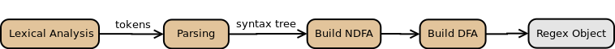
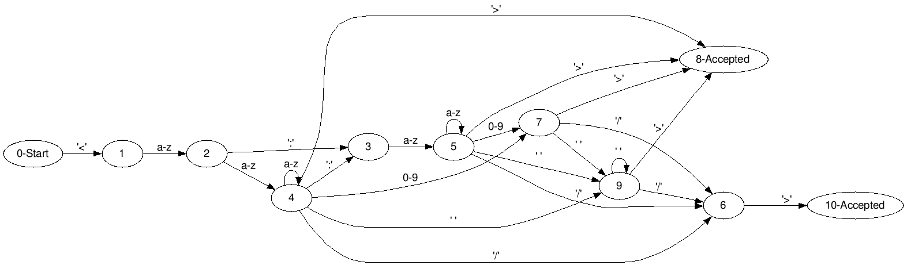
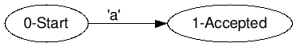
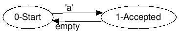
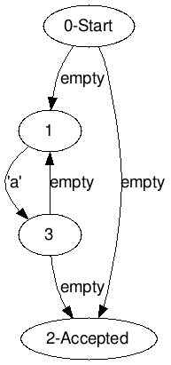
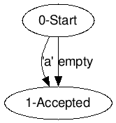
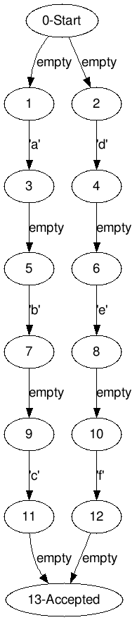
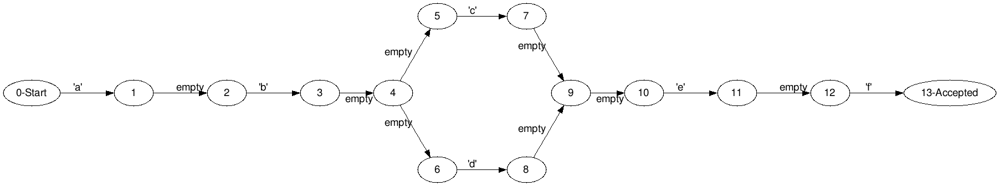
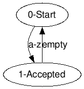

## Architecture

### Overview

The core of the application lies in the construction of a deterministic finite automaton, which is executed by the Regex object. Notice that a regular language, which is the type of language that regular expressions describe, can be recognized by a finite deterministic automaton.

We differentiate two parts when describing the application:

1. Regex compilation.
2. Regex execution

Given a regex modeled as *java.lang.String* the following steps will be execute until its **compilation** in an object of type Regex:


1. Lexical analysis of the regexp, obtaining the minimum syntactic pieces (tokens).
2. Syntax analysis of the regexp. Check if the regexp is correct and builds the tree of syntactic nodes.
3. Construction of a non-deterministic finite automaton (NDFA) from the syntax tree. This is done through hompson's construction algorithm. In this part also some semantic analysis is realized, especially in what concerns to the ranges.
4. Conversion of the non-deterministic finite automaton into a deterministic finite automaton (DFA) The Powerset construction algorithm is used.
5. Store DFA in *Regex* object.

Given a regexp **compiled** in a Regex object, the following steps are followed for its **execution** on a text:

1. The automaton starts from inital state. While there are transitions, the engine tries to execute each transition for each character of input buffer until automaton reaches acceptance state or no more transitions.
2. If automaton reaches an acceptance state buy there are more transitions, engine will continue reading characters for matching that transitions.

It is considered that there is coincidence (and stops the analysis) when:

- The automaton is in a state of acceptance and there are no more transitions.
- The text is finished and the automaton is in a state of acceptance (this happens when processing a regexp with quantizer asterisk)
- There are more transitions in a state of acceptance and the incoming character does not fulfill any input.

Diagram that presents the phases of the compilation of the regexp:



In the following image we can observe the deterministic finite automaton that the engine builds to execute the regexp:

`<[a-z]+:?[a-z]+[0-9]?\\s*(/>|>)` (1)

that matches HTML tags.



### Parsing regex

This subset of PCRE requires a free context grammar.

Lexical tokens are:

`'('  ')'  '*'  '+'  '?'  '['  '\'  '|'`

and grammar rules in EBNF syntax are:

```
1.     <regexp> ::= <quantified_expression> { <quantified_expression> } <regex>
2.     <regex> ::= '|' <regexp>
3.                | empty-word
4.     <quantified_expression> ::= <expression> [ <quantifier> ]
5.     <expression> ::=  <selector>
6.                     | '(' <regexp> ')'
7.     <selector> ::= <symbol>
8.                  | <range>
9.     <range> ::= '[' <char_range> ']'
10.    <char_range> ::=  <symbol>
11.                   | <escape_char> { <char_range> }
12.    <symbol> ::= <char>
13.               | <escape>
14..21 <char> ::= Printable characters except '(' | ')' | '*' | '+' | '?' | '[' | '\' | '|'
22..30 <escape_char> ::=    '(' | ')' | '*' | '+' | '?' | '[' | '\' | '|'
31..37 <escape> ::= '\' <escape_char> | 's' | 't' | '-' | ']' | '^' | '.'
38.    <quantifier> ::= '*'
39.       | '+'
40.       | '?'
41.       
```

Notice that in the specification of ranges (production 9) does not appear '-' character and positions because parsing ranges is moved to semantic analysis process. This is due to it is more simple in this phase than syntax analysis phase.


In code, tokens have an unique id. This ID's are modele in a Java enum:

```
'(' -> L_PARENTHESIS
')' -> R_PARENTHESIS
'*'  '+'  '?' -> QUANTIFIER
'[' -> R_BRACKET
'\' -> ESCAPE
'|' -> PIPE
```

```java

public enum Token {

    /* tokens */
    CHAR, L_PARENTHESIS, R_PARENTHESIS, L_BRACKET, PIPE, QUANTIFIER, ESCAPE,

    /* elementos sintácticos */
    REGEX, SELECTOR, RANGE, QUANTIFIED_EXPR, GROUP, EXPRESSION, CHAR_RANGE, REGEXP,
    /* elementos auxiliares */
    ROOT,
}
```

Lexical analysis is done by *LexicalAnalyzer* class.


In this class, method *verifyEscapeCharacters* checks if an escape char is specified.

Method *readCharacter* ignore tabs and spaces.

#### Parser

Parser is a descent-recursive-parser type.

Este tipo de parsers son muy comunes y fáciles de implementar. Para poder codificarlos con facilidad es muy conveniente que la gramática dada sea LL(1), ya que leyendo sólo un token por adelantado omitimos la necesidad de "volver hacia atrás" en caso de que llegue un token que no corresponde con la producción que se analiza en ese momento.

This kind of parser are easy to implement and they are more common. For an easy implementation is very important that grammar are of type LL(1) since reading an only forward-token we avoid problems as backtracking, which is hard to implement.

This kind of parsers define a procedure for each production of the grammar. In each procedure, the tokens are consumed in the order that has been established in that grammar. If a token is consumed this is not expected, syntax error is thrown.

By example, for productions 5 and 6:

```
7.     <selector> ::= <symbol>
8.	              | <range>
```

We can code as:

```java
private void prSelector() {

    if (match(Token.CHAR, Token.ESCAPE)) {
        prSymbol();
    } else if (token == Token.L_BRACKET) {
        prRange();
    }
}    
```
There is a if-else sentence because production has two alternatives. Notice as code structure is similar to grammar specification.

The CHAR token and the ESCAPE token are checked because the <symbol> production consists of these two terminal symbols:

```
12.    <symbol> ::= <char>
13.             | <escape>
```

Here we used a new method: *consume*. This method request a token to lexer. This method read and consume token, while *match* method only check next token requested to lexer but not consume it.

```java
private Token consume(String c) {
    String tokenValue = lexicalAnalyzer.getTokenValue();
    if (!c.equals(tokenValue)) {
        parseError(new String[] { c });
    }
    readNextToken();
    return token;
}
```

*readNextToken* method load next token in lexer buffer and prepare for next request.


Other example. For prodcution:

```
1. <regexp> ::= <quantified_expression> { <quantified_expression> } <regex>
```

The code is:

```java
private ASTNode prRegexp() {
        ASTNode node = createNode(Token.REGEXP);

        // at least a quantified expression.
        if (match(Token.CHAR, Token.ESCAPE, Token.L_BRACKET, Token.L_PARENTHESIS)) {
            ASTNode n = prQuantifiedExpression();
            addChildNode(node, n);
        } else {
            parseError(Token.CHAR, Token.ESCAPE, Token.L_BRACKET, Token.L_PARENTHESIS);
        }

        // next zero or more
        while (match(Token.CHAR, Token.ESCAPE, Token.L_BRACKET, Token.L_PARENTHESIS)) {
            ASTNode n = prQuantifiedExpression();
            addChildNode(node, n);
        }
        // now a <regex>
        ASTNode regexNode = prRegex();

        // it may be empty word
        if (regexNode != null) {
            addChildNode(node, regexNode);
        }

        return node;
    }
```

Actually what is being done is to simulate an pushdown automaton, which is the type of automaton that recognizes context-free grammars.

#### Building syntax tree

Building the syntax tree is very simple in an analyzer like the one implemented because making the calls in descending and recursive form, it facilitates considerably the task of managing a tree data structure. In fact, this syntax tree is only a reflection of all calls to each of the productions when running parser.

Syntax node is modeled by class *ASTNode*. Parser returns an ASTNode object by each production processed.

Each production will instantiate an ASTNode object and assign it a token and its value. At the same time, it will add as child nodes the calls to its child productions.

By example, for `<expression>`:

```java
private ASTNode prExpression() {
    ASTNode node = createNode(Token.EXPRESSION);
    if (match(Token.CHAR, Token.ESCAPE, Token.L_BRACKET)) {

        ASTNode n = prSelector();
        addChildNode(node, n);

    } else if (match(Token.L_PARENTHESIS)) {

        ASTNode nodeGroup = createNode(Token.GROUP);

        consume(Token.L_PARENTHESIS);
        ASTNode regex = prRegexp();
        consume(Token.R_PARENTHESIS);

        addChildNode(nodeGroup, regex);
        addChildNode(node, nodeGroup);
    }
    return node;
}
```

Notice that production returns its ASTNode instance and this is added to current ASTNode in parser.

Next figure is syntax tree for ab+ regex.


#### Automatons.

The automatons are modeled as a directed graph. The data structure choosed for this is an adjacency list. Pointers to next nodes in the graph are the transitions in the automaton.

Each node in the graph represents a state for automaton execution and the graph *vertices* are the state transitions for automaton.

Automaton's states are modeled by *State* class and transitions by *Transition* interface. Each transition is equivalent to a regex's rule.

Transition interface is implemented by next classes, each or them represents a rule type of the regex engine:

- *TransitionEmpty.* Models empty transition. It is essential for build the NDFA.
- *TransitionExclude.* [^abcd...] transition.
- *TransitionExcludeRange.* [^a-z] transition.
- *TransitionRange.* [a-z] transition and char selector. For this second case simply states that the beginning and end of the range is the same character.

*Automaton* class will contains a reference to the first state as well as the list of transitions and the list of states. Keeping the two lists is useful when the algorithm that will reduce the NDFA to a deterministic automaton is executed.

##### Bulding NDFA

A regular language can be analyzed by a non-deterministic finite automaton, so the next phase of the regexp engine is build this automaton.

To build an NDFA from a regular expression **Thompson's algorithm** can be used. It associates each **minimal regular expression with a non-deterministic finite automaton.**

Let's see the NDFA for each regex rule in this engine:

1. 'character' regex (or minimal selector)



2. For a regex with '+' quantifier (for example *a+*)



3.  For a regex with '*' quantifier (for example *a**)



4. For a '?' regex,  (for example *a?*)



5. For regex 'R1|R2' like abc|def



6. For regex of kind ab(c|d)ef



The ranges are still selectors, so the generated NDFA are equals to those of a single character. The fundamental difference is that for *[a-z]* range it is not optimal to create 26 transitions, so a transition type representing ranges has been created (class *TransitionRange*)

For example, NDFA for regex *[a-z]+*



The class that builds NFDA is *AutomatonBuilder*. The method *generateNFA(ASTNode node)* generates this NFDA from root node of syntax tree.

#### Building DFA and associate to regex runner.

To implement a NDFA runner is quite cumbersome. Is  better convert NDFA to equivalent DFA. For this *Powerset construction algorithm* is used. Class *Automaton* has method *generateDFA* for this.

Once generated, DFA is assigned to an instance of *Regex* object and used for matching inputs.

Next code shows overview òf all process explained above:

```java
public static Regex compile(String regexExpr) throws RegexException {

        LexicalAnalyzer lexicalAnalyzer = new LexicalAnalyzer(regexExpr);
        Parser syntaxAnalyzer = new Parser(lexicalAnalyzer);

        ASTNode syntaxNodeTree = syntaxAnalyzer.analyze();
        LOGGER.debug("Syntax tree:\n graph g {\n{}\n};\n", syntaxNodeTree.toString());

        Automaton nfa = AutomatonBuilder.generateFromAST(syntaxNodeTree);
        LOGGER.debug("Nondeterministic finite automaton:\n digraph ndfa {\n{}\n};\n", nfa.toString());

        Automaton dfa = AutomatonBuilder.generateDFAFromNFA(nfa);
        LOGGER.debug("Deterministic finite automaton:\n digraph dfa {\n{}\n};\n", dfa.toString());
        return new Regex(dfa);
}
```

There is a log4j.properties file for output generated graphs in Graphviz format if log level is set to DEBUG. This is useful for generating images of internal structure of automatons or syntax tree.
